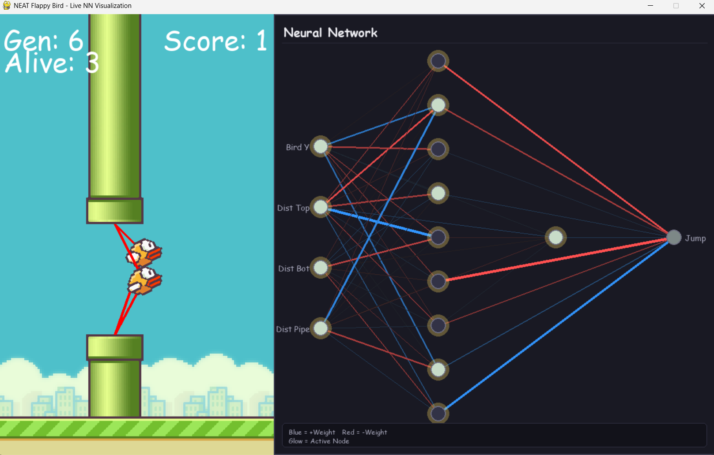
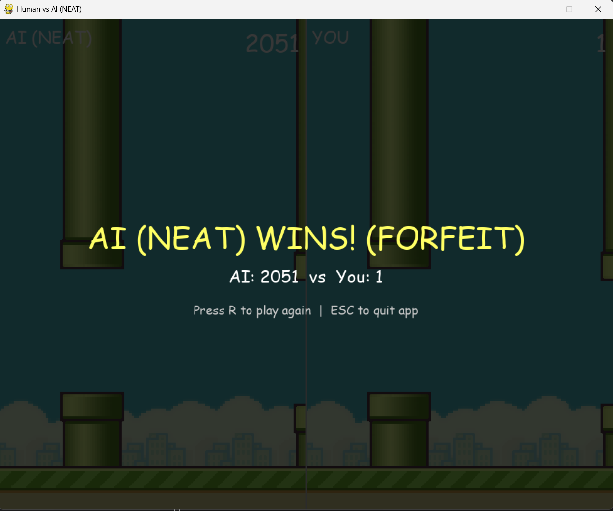

#  AI Flappy Bird with NEAT

An interactive machine learning project that trains autonomous agents to play Flappy Bird using the **NEAT** (*NeuroEvolution of Augmenting Topologies*) algorithm. Includes real-time neural network topology visualization during training, CSV metrics logging, and a split-screen **Human vs. NEAT AI** gameplay mode.

---

## 🚀 Key Features

- **🤖 Autonomous NEAT Evolution**: Evolves neural network structures and weights across generations to master obstacle navigation without human intervention.
- **🧠 Live Neural Network Visualizer**: Dynamic side-panel (300px) showing node activations, connection weights, and evolving topology of the leading bird during training (toggleable with **`V`**).
- **⚔️ Human vs. NEAT AI Mode**: Split-screen (1000px) head-to-head competition against your best trained NEAT agent under identical pipe generation conditions.
- **📊 CSV Training Logs**: Automatically exports generational metrics (max score, average fitness, population count) for performance tracking.
- **💾 Automatic Model Serialization**: Serializes top-performing network genomes (`models/best_neat.pickle` or `best.pickle`) for immediate inference.

---

## 📁 Project Structure

```text
AI-Flappy-Bird/
├── flappy_bird.py          # NEAT training engine, main execution loop, and CSV logger
├── nn_visualizer.py        # Real-time neural network visualization panel class
├── human_vs_ai.py          # Split-screen Human vs NEAT AI game mode
├── bird.py                 # Bird physics, jump mechanics, rotation, and mask collisions
├── pipe.py                 # Pipe generation, gap spacing, and offset-aware collision logic
├── base.py                 # Ground scrolling mechanism and offset rendering
├── config-feedforward.txt  # NEAT algorithm configuration parameters
├── requirements.txt        # Python dependencies
├── imgs/                   # Game visual assets (bird frames, pipes, base, background)
└── models/                 # Output directory for serialized trained models
    └── best_neat.pickle    # Saved best NEAT model genome
```

---

## 📝 Detailed Module Breakdown

### 1. `flappy_bird.py` — Evolutionary Training Loop
* **Window Size**: 800px × 800px (500px gameplay + 300px NN visualization panel).
* **Key Responsibilities**:
  * Initializes the NEAT population from `config-feedforward.txt`.
  * Evaluates fitness per frame and tracks the generation's highest-performing "leader" bird.
  * Feeds leader input/activation data to the `NeuralNetworkVisualizer`.
  * Logs training statistics to CSV and saves model checkpoints upon reaching target fitness.

### 2. `nn_visualizer.py` — Real-Time Topology Visualizer
* **Class**: `NeuralNetworkVisualizer`
* **Functionality**: Rebuilds and renders the leading bird's neural network on every frame:
  * **Blue Lines**: Positive (excitatory) connection weights.
  * **Red Lines**: Negative (inhibitory) connection weights.
  * **Line Thickness**: Proportional to weight magnitude (|w|).
  * **Yellow Glow**: Highlights active nodes (high activation state).

### 3. `human_vs_ai.py` — Human vs. AI Split-Screen
* **Window Size**: 1000px × 800px (500px AI panel + 500px Human panel).
* **Mechanism**: Loads the trained model via `NEATAIController` and mirrors game physics for both panels.
* **Deterministic Fairness**: Seeds pipe layouts with `random.seed(42)` at the start of each round, guaranteeing that both human and AI face the exact same obstacle distribution.

### 4. `config-feedforward.txt` — NEAT Configuration
* **Inputs (3)**: `Bird Y`, `Distance to Top Pipe`, `Distance to Bottom Pipe`.
* **Outputs (1)**: `Jump` decision (activated if output > 0.5).
* **Population Size**: 50 birds per generation.
* **Network Structure**: Starts with 0 hidden nodes; NEAT dynamically adds nodes and connections through structural mutation.

---

## ⚙️ Fitness Calculation

During NEAT training, birds accumulate fitness based on the following evaluation function:

Fitness = (+0.1 × frames alive) + (+5.0 × pipes cleared) - (1.0 × collision penalty)

- **`+0.1` per frame alive**: Rewards continuous survival and altitude management.
- **`+5.0` per pipe passed**: Strongly incentivizes goal progression.
- **`-1.0` on collision**: Penalizes crashing into pipes, ground, or ceiling.

---

## 🛠️ Installation & Setup

1. **Clone the repository**
   ```bash
   git clone [https://github.com/chethanreddy10/AI-Flappy-Bird.git](https://github.com/chethanreddy10/AI-Flappy-Bird.git)
   cd AI-Flappy-Bird
   ```

2. **Install dependencies**
   ```bash
   pip install -r requirements.txt
   ```

---

## 🎮 How to Run

### 1. Train the NEAT AI
Run the evolutionary training process to generate your AI model:
```bash
python flappy_bird.py
```
* **Hotkeys**: Press **`V`** to show or hide the real-time neural network visualizer panel.


Eg: This one i have started with hidden_nodes=10 in the config file , we can see it has evolved and put an extra hidden layer and 1 node in it.
Imp_Note: Start with minimumal topology (hidden_nodes =0) it is better to start with a minimal topology than a randomly initialized topology . It wil addon nodes and connections if it is necessary through evolution.

### 2. Play Human vs. NEAT AI
Compete against your trained model in split-screen mode:
```bash
python human_vs_ai.py
```


#### Controls
| Screen / Phase | Key | Action |
| :--- | :---: | :--- |
| **Selection Screen** | `1` | Start match vs NEAT AI |
| **Selection Screen** | `ESC` | Exit application |
| **In-Game** | `SPACE` | Jump (Human bird) |
| **In-Game** | `Q` / `ESC` | Forfeit round (Triggers AI victory) |
| **Game Over** | `R` | Restart round |
| **Game Over** | `ESC` | Exit application |

---


I Gave up! since its taking long. It is performing well achieving over 1500+ score consistently.

## 🤝 Contributing

1. Fork the repository
2. Create a feature branch (`git checkout -b feature/AmazingFeature`)
3. Commit your changes (`git commit -m 'Add AmazingFeature'`)
4. Push to the branch (`git push origin feature/AmazingFeature`)
5. Open a Pull Request

---

## 🙏 Acknowledgments

- **Kenneth O. Stanley**: Creator of the NEAT algorithm.
- **`neat-python`**: Neuroevolution library implementation.
- **Pygame Community**: Python game development engine.